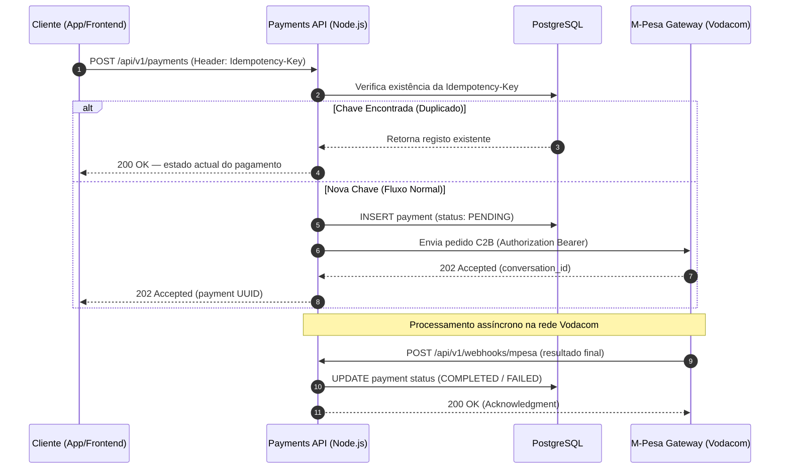
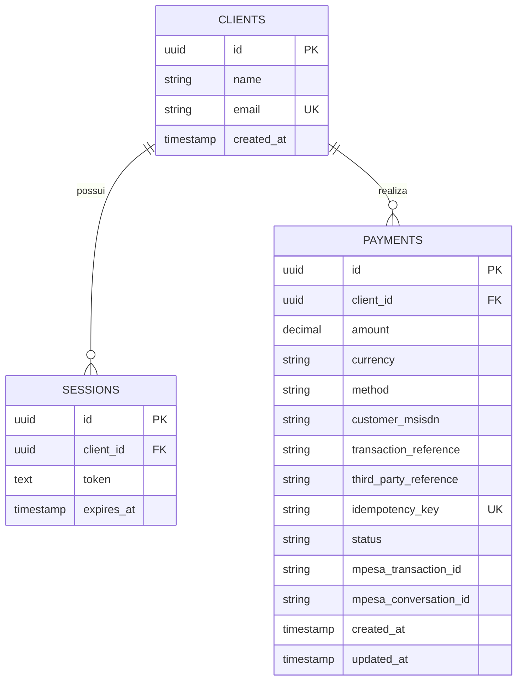

# Documento de Arquitetura de Software — Payments API

**Histórico de Revisão**

| Data | Versão | Descrição | Autor |
|------|--------|-----------|-------|
| 2026-05-08 | 1.0 | Versão inicial do documento | Equipa Técnica |

---

## 1. Introdução

### 1.1 Finalidade

Este documento tem como objectivo apresentar uma visão geral e abrangente da arquitectura de software da **Payments API**, especificando as decisões arquitecturais tomadas durante o seu desenvolvimento. Destina-se à equipa técnica interna e serve como referência para desenvolvimento, manutenção e evolução do sistema.

### 1.2 Escopo

A Payments API é um microserviço RESTful desenvolvido para mediar transações de pagamento electrónico entre clientes e a rede M-Pesa (Vodacom Moçambique), no modelo **C2B (Customer to Business)**. O sistema gere o ciclo de vida completo de um pagamento — desde a autenticação do cliente, passando pela criação idempotente da transação, até à confirmação assíncrona via webhook.

O sistema encontra-se actualmente em **fase de testes / staging**, preparado para deploy em ambiente de produção no cluster Kubernetes do Wolke Host.

### 1.3 Definições, Acrônimos e Abreviações

| Abreviação | Definição |
|------------|-----------|
| API | Application Programming Interface |
| C2B | Customer to Business (modelo de pagamento M-Pesa) |
| REST | Representational State Transfer |
| HTTP | Hypertext Transfer Protocol |
| UUID | Universally Unique Identifier |
| JWT | JSON Web Token |
| PK | Primary Key |
| FK | Foreign Key |
| UK | Unique Key |
| ORM | Object-Relational Mapping |
| K8s | Kubernetes |
| MSISDN | Mobile Station International Subscriber Directory Number (número de telemóvel) |

### 1.4 Visão Geral

Este documento está organizado nas seguintes secções:

1. Introdução
2. Representação da Arquitectura
3. Metas e Restrições de Arquitectura
4. Visão Lógica
5. Visão de Implementação
6. Especificação de Endpoints
7. Tamanho e Desempenho
8. Qualidade
9. Referências

---

## 2. Representação da Arquitectura

A Payments API foi concebida como um **microserviço stateless e resiliente**, seguindo os princípios de **Clean Architecture**. Toda a lógica de negócio está encapsulada num único serviço, que comunica com a base de dados PostgreSQL para persistência e com a API da Vodacom para processamento de pagamentos.

O sistema adopta o padrão de **Eventual Consistency** e **Fail-Fast**, garantindo que nenhuma transação seja duplicada ou perdida em caso de instabilidade de rede — protegido pelo mecanismo de idempotência ao nível do middleware.

### 2.1 Diagrama de Relações

```
┌─────────────────────────────────────────────────────────────────┐
│                        Cliente (App / Frontend)                  │
└───────────────────────────────┬─────────────────────────────────┘
                                │ HTTPS
                                ▼
┌─────────────────────────────────────────────────────────────────┐
│                    Kubernetes Cluster (Wolke Host)               │
│                                                                  │
│   ┌─────────────────────────────────────────────────────────┐   │
│   │                    Payments API (Node.js)                │   │
│   │                                                          │   │
│   │   ┌──────────┐  ┌──────────┐  ┌──────────┐             │   │
│   │   │  Routes  │→ │ Services │→ │Gateways  │             │   │
│   │   └──────────┘  └──────────┘  └────┬─────┘             │   │
│   │                      │             │                     │   │
│   │               ┌──────┘             │ HTTPS               │   │
│   │               ▼                    ▼                     │   │
│   │         ┌──────────┐      ┌─────────────────┐           │   │
│   │         │Repositories│    │ M-Pesa Gateway  │           │   │
│   │         └─────┬─────┘    │  (Vodacom API)  │           │   │
│   │               │           └────────┬────────┘           │   │
│   └───────────────┼────────────────────┼────────────────────┘   │
│                   │                    │ Webhook (POST)           │
│                   ▼                    ▼                          │
│           ┌──────────────┐     (retorna ao serviço)              │
│           │  PostgreSQL  │                                        │
│           └──────────────┘                                        │
└─────────────────────────────────────────────────────────────────┘
```

---

## 3. Metas e Restrições de Arquitectura

| Restrição | Detalhe |
|-----------|---------|
| **Linguagem** | JavaScript (Node.js) |
| **Runtime** | Node.js (LTS) |
| **Base de dados** | PostgreSQL |
| **Plataforma** | Web — REST API |
| **Orquestração** | Kubernetes (Wolke Host) |
| **Segurança** | Autenticação por token de sessão em cada requisição protegida; webhook protegido por IP allowlist ou token partilhado da Vodacom |
| **Idempotência** | O header `Idempotency-Key` é validado por middleware antes de qualquer criação de pagamento, garantindo que cliques duplos não geram transações duplicadas |
| **Idioma** | Português (PT) |
| **Versionamento da API** | Prefixo `/api/v1/` em todos os endpoints, permitindo evolução sem quebrar contratos existentes |
| **Observabilidade** | Logs estruturados em formato JSON via Pino |

---

## 4. Visão Lógica

### 4.1 Visão Geral: Pacotes e Camadas (Clean Architecture)

O projecto está organizado em quatro camadas fundamentais, garantindo separação de responsabilidades, testabilidade (Jest) e facilidade de manutenção:

```
src/
├── entities/          # Domínio — modelos e regras de negócio puras
├── services/          # Use Cases — orquestração da lógica de aplicação
├── gateways/          # Infraestrutura externa — integração com M-Pesa
├── repositories/      # Persistência — acesso ao PostgreSQL
├── middlewares/       # Validações transversais (auth, idempotência)
├── routes/            # Definição dos endpoints HTTP
└── config/            # Configurações, variáveis de ambiente, K8s secrets
```

#### 4.1.1 Entities (Domínio)

Define os modelos de dados puros e as regras de negócio independentes de qualquer framework ou base de dados. Exemplo: a definição do ciclo de vida de um pagamento (`PENDING` → `COMPLETED` / `FAILED`) e as regras de validação do `amount` e do `customer_msisdn`.

#### 4.1.2 Services (Use Cases)

Camada de orquestração. É aqui que reside a lógica que decide se um pagamento deve ser criado, se a `Idempotency-Key` já existe na base de dados, ou se deve ser consultado o estado actual. Os services não conhecem o HTTP nem a implementação concreta da base de dados.

#### 4.1.3 Gateways (Infraestrutura Externa)

Encapsula toda a complexidade da comunicação com a API do M-Pesa (via SDK ou Axios), incluindo autenticação `Bearer`, serialização dos pedidos C2B e interpretação das respostas `202 Accepted`. Se o provedor mudar para a E-Mola ou outro gateway, apenas esta camada é alterada.

#### 4.1.4 Repositories (Persistência)

Implementação do acesso ao PostgreSQL. Isola toda a lógica SQL — incluindo o trigger de `updated_at`, os `Unique Constraints` e as queries de paginação do histórico — do restante da aplicação.

### 4.2 Middlewares

Os middlewares actuam como guardas transversais antes de qualquer lógica de negócio:

| Middleware | Responsabilidade |
|------------|-----------------|
| `authMiddleware` | Valida o token de sessão em cada rota protegida |
| `idempotencyMiddleware` | Verifica e regista a `Idempotency-Key` antes de criar pagamentos |
| `adminMiddleware` | Garante permissões de administrador nos endpoints de auditoria |

### 4.3 Diagrama de Sequência — Fluxo de Idempotência e Gateway



---

## 5. Visão de Implementação

### 5.1 Modelo de Dados — Entidades Principais

#### CLIENTS

| Coluna | Tipo | Restrição |
|--------|------|-----------|
| id | uuid | PK |
| name | string | |
| email | string | UK |
| created_at | timestamp | |

#### SESSIONS

| Coluna | Tipo | Restrição |
|--------|------|-----------|
| id | uuid | PK |
| client_id | uuid | FK → CLIENTS.id |
| token | text | |
| expires_at | timestamp | |

#### PAYMENTS

| Coluna | Tipo | Restrição / Notas |
|--------|------|-------------------|
| id | uuid | PK |
| client_id | uuid | FK → CLIENTS.id (opcional) |
| amount | decimal | Precisão 12,2 |
| currency | string | Ex: MZN |
| method | string | Ex: MPESA |
| customer_msisdn | string | Número de telemóvel do pagador |
| transaction_reference | string | |
| third_party_reference | string | |
| idempotency_key | string | UK — garante unicidade |
| status | string | PENDING, COMPLETED, FAILED |
| mpesa_transaction_id | string | |
| mpesa_conversation_id | string | |
| created_at | timestamp | |
| updated_at | timestamp | Gerido por trigger automático |

### 5.2 Diagrama ERD



---

## 6. Especificação de Endpoints

Todos os endpoints protegidos requerem o header `Authorization: Bearer <token>`.

### 6.1 Autenticação e Sessão

| Método | Rota | Descrição | Parâmetros / Body |
|--------|------|-----------|-------------------|
| `POST` | `/api/v1/auth/login` | Autentica o cliente e gera uma nova sessão | `{ email, password }` |
| `POST` | `/api/v1/auth/logout` | Invalida a sessão actual e remove o token | `Header: Authorization` |

### 6.2 Pagamentos (Core)

| Método | Rota | Descrição | Parâmetros / Body |
|--------|------|-----------|-------------------|
| `POST` | `/api/v1/payments` | Inicia um processo de pagamento C2B. Requer `Idempotency-Key` | `Header: Idempotency-Key`<br>`Body: { amount, customer_msisdn, transaction_reference, third_party_reference }` |
| `GET` | `/api/v1/payments/:id` | Consulta o estado actual de um pagamento específico | `Path: id (UUID)` |
| `GET` | `/api/v1/payments/history` | Lista o histórico de pagamentos do cliente autenticado | `Query: ?page=1&limit=10` |

### 6.3 Webhooks (Sistema)

Endpoint público, protegido por IP allowlist da Vodacom ou token de segurança partilhado.

| Método | Rota | Descrição | Parâmetros / Body |
|--------|------|-----------|-------------------|
| `POST` | `/api/v1/webhooks/mpesa` | Recebe a confirmação de sucesso ou falha da Vodacom | `Body: { conversation_id, status, receipt_id, ... }` |

### 6.4 Gestão e Monitorização (Admin)

| Método | Rota | Descrição | Parâmetros / Body |
|--------|------|-----------|-------------------|
| `GET` | `/health` | Liveness/Readiness probe para o cluster Kubernetes | Nenhum |
| `GET` | `/api/v1/admin/logs` | Consulta logs de auditoria (requer permissão de Admin) | `Query: ?payment_id=uuid` |

---

## 7. Tamanho e Desempenho

A Payments API é um **serviço stateless**, o que significa que não guarda qualquer estado em memória entre requisições. Toda a persistência é delegada ao PostgreSQL, permitindo escalar horizontalmente com múltiplas réplicas sem conflitos de estado.

**Estratégia de escalabilidade no Kubernetes:**

- O Deployment pode ser configurado com `N` réplicas conforme o tráfego aumenta, sem qualquer alteração ao código.
- O `HorizontalPodAutoscaler` (HPA) pode ser configurado com base em métricas de CPU ou de pedidos por segundo.
- O endpoint `/health` serve como `livenessProbe` e `readinessProbe`, garantindo que o K8s substitua réplicas com falha automaticamente.

**Volume esperado:** O sistema foi dimensionado para suportar o volume de transações M-Pesa de uma operação C2B de médio porte. Para volumes muito elevados, recomenda-se a introdução de uma fila de mensagens (ex: Redis ou RabbitMQ) para desacoplar o processamento do webhook do ciclo de vida do pedido HTTP.

---

## 8. Qualidade

A arquitectura garante as seguintes metas de qualidade:

**Resiliência** — O uso de `Unique Constraints` ao nível da base de dados, combinado com o middleware de idempotência, cria duas camadas de defesa contra transações duplicadas em sistemas distribuídos.

**Observabilidade** — Logs estruturados em formato JSON via Pino permitem que ferramentas de monitorização (Grafana, Datadog, etc.) identifiquem erros de transação em milissegundos e rastreiem o ciclo de vida de cada pagamento pelo seu UUID.

**Testabilidade** — A separação em camadas (Clean Architecture) permite testar cada camada isoladamente com Jest, sem necessidade de uma base de dados real ou de acesso à API da Vodacom (via mocks/stubs).

**Manutenibilidade** — O encapsulamento da integração com o M-Pesa na camada de Gateways garante que uma mudança de provedor (ex: para a E-Mola) não afecta a lógica de negócio nem a camada de persistência.

**Segurança** — As chaves de API, certificados e credenciais da Vodacom são geridos exclusivamente através de Variáveis de Ambiente e Kubernetes Secrets, nunca expostos no código-fonte. O audit trail é garantido pelos campos `created_at` e `updated_at` em cada registo de pagamento.

---

## 9. Referências

- M-Pesa API — Documentação Oficial da Vodacom Moçambique
- Clean Architecture — Robert C. Martin (Uncle Bob)
- Kubernetes Documentation — [https://kubernetes.io/docs](https://kubernetes.io/docs)